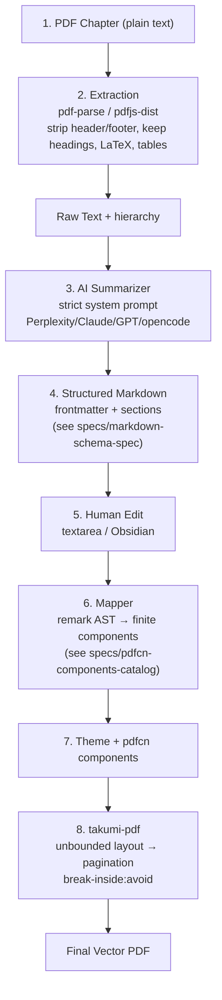

# Architecture — Washi MVP1

## End-to-End Pipeline Diagram



## Layer Separation (Non-Negotiable)

1. **Content** — source chapter text
2. **Intelligence** — LLM summarization (source-grounded only)
3. **Design** — finite component mapping (no content rewrite)
4. **Rendering** — takumi-pdf physical layout (pixel truth)

> No single LLM call owns all four. See [[decisions/ADR-001-pipeline-architecture]].

## Extraction Layer

- Input: plain-text PDF (OCR deferred)
- Lib: `pdf-parse` (simpler) or `pdfjs-dist` (more control)
- Must: strip running headers/footers/page numbers, preserve `##`, lists, `$$ LaTeX $$`, `| tables |`, `[1]` citations
- Output: `chapter.raw.txt` + character count for prompt budgeting
- No scanned handling for MVP1

## LLM Layer — Strict Per-Chapter Prompt

- System prompt: [[prompts/01-chapter-summarizer-prompt]] — constant across chapters, only params `subject/language/inputText` change
- Constraints: zero hallucination, preserve exact terms (TCP, OSI, NP-complete), preserve LaTeX, emit `<!-- source: p.X -->` or frontmatter `sources:`
- Model flexible: Perplexity / Claude / ChatGPT / opencode go — same prompt

See [[decisions/ADR-003-llm-summarization-strategy]].

## Markdown as Source of Truth

- Markdown is portable, Git-friendly, future RAG-ingestible, regenerable
- PDF is build artifact — `Markdown + theme + pdfcn ver + takumi ver = PDF` (reproducible)
- Schema: [[specs/markdown-schema-spec]]

Example:

```md
---
subject: computer-networks
theme: default
title: Transport Layer
language: ar
sources: [{document: Textbook.pdf, pages: [142, 143]}]
---

# طبقة النقل

## TCP

TCP is connection-oriented.

> [!IMPORTANT]
> TCP يهتم بالموثوقية.

## مقارنة

| Feature | TCP | UDP |
|---|---|---|
| Reliability | Yes | No |

$$
Throughput = \frac{Window}{RTT}
$$

<!-- source: Textbook.pdf p.142 -->
```

## Mapper Layer — Deterministic (No Second AI for MVP1)

- Parser: `remark` / `unified` → AST
- Rules (see corrected [[specs/pdfcn-components-catalog]] — composed via `KeepTogether`):

```
#           → Section + Heading L1 + PageBreak
##          → Section + Heading L2
###         → Heading L3
> [!NOTE] + **Term:** → KeepTogether(Card(Heading+Text)) — Definition
> [!IMPORTANT]        → KeepTogether(Alert variant important) — Callout
> [!WARNING]          → KeepTogether(Alert variant warning) — Callout
$$...$$ / $...$       → KeepTogether(Card(PdfImage)) — Formula via render-formula.ts
| ... |               → DataTable / Table (ComparisonTable)
           → KeepTogether(PdfImage+Text) — Figure
```Code```            → KeepTogether(Card(Text monospace)) — CodeBlock
```

- For MVP1: **rule-based mapping, not Ask LLM to map**. Keeps deterministic & testable.
- Intermediate AST JSON preferred over direct JSX — see [[prompts/02-markdown-to-pdfcn-mapper]] for JSON example

## pdfcn + takumi-pdf Layer

- `pdfcn` is **registry** (shadcn style): `npx shadcn add @pdfcn/<component>` copies source into `components/pdfcn/` — you own it, agent can read/edit, requires Node 20+ + `components.json`
- Repo: https://github.com/shadcn-labs/pdfcn — MIT, supports Takumi & Forme bases
- Theme for MVP1: single default theme (`themes/default/tokens.ts`) — multi-theme deferred to MVP2

### Pagination — Why NOT a Custom AI Layout Engine

Previous assumption was an AI must compute height budgets. **Solved natively by takumi-pdf** (https://takumi.kane.tw/docs/pdf/pagination):

- Unbounded layout → fragmented into pages
- `break-inside: avoid` keeps a card/formula/callout on one page if it fits
- Unsplittable atoms (text lines, images) never cut mid-element — whole unit moves to next page
- Backgrounds/borders repeat correctly
- Edge: if `break-inside: avoid` element > one page tall, rule cannot be honored (same as browser print) — designer must chunk it

**So for MVP1 (corrected 2026-08-23):**

```tsx
// Preferred: use pdfcn primitive KeepTogether (wraps break-inside:avoid)
<KeepTogether><Card><Heading>{term}</Heading><Text>{def}</Text></Card></KeepTogether> // Definition
<KeepTogether><Alert variant="important">{content}</Alert></KeepTogether>            // Callout
<KeepTogether><Card><PdfImage src={svgFromLatex} /></Card></KeepTogether>             // Formula
// Fallback CSS if not using KeepTogether directly:
<div className="break-inside-avoid"> ... </div>
<thead className="table-header-group">  // repeat table header on each page
<h2 className="break-after-avoid">     // avoid orphan heading
```

Let takumi decide page breaks. AI's job = pick correct composition only — see corrected [[specs/pdfcn-components-catalog]].

Full rules: [[specs/pagination-rules]] and [[decisions/ADR-002-takumi-pdfcn-pagination]]

## Data Flow & File Ownership

```
washi/  (outside vault, e.g., C:\Users\gokoq\prog\washi — formerly academic-publisher)
├── content/ chapter-04.raw.txt  (extraction output)
├── content/ chapter-04.md       (AI output, human-edited, source truth)
├── components/pdfcn/            (shadcn-installed, owned)
├── themes/default/
├── lib/markdown-parser.ts       (remark → AST → component tree)
├── app/editor/page.tsx          (textarea + Generate PDF button)
└── app/api/render/route.ts      (AST → JSX → takumi-pdf → PDF buffer)
```

Vault `projects/academic-publisher/` holds **docs & prompts**, NOT the Next.js code. App references vault specs.

## Verification Points

- [ ] Open graph view — all `[[...]]` resolve
- [ ] Extraction preserves headings & LaTeX
- [ ] Summarizer prompt produces schema-compliant Markdown every run
- [ ] Mapper produces only allowed component types
- [ ] PDF with large table: header repeats, no cut-through
- [ ] PDF with large Figure: aspect ratio locked, moves whole to next page if needed

## Related

- [[specs/pagination-rules]] — detailed CSS paged media
- [[prompts/03-overflow-and-pagination]] — how to instruct AI about pagination
- Prior reference (do not rebuild): https://github.com/AboALhasanx/New-project/tree/master/sdre-publisher
